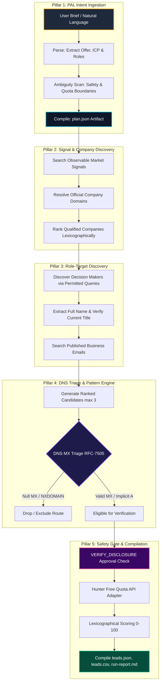
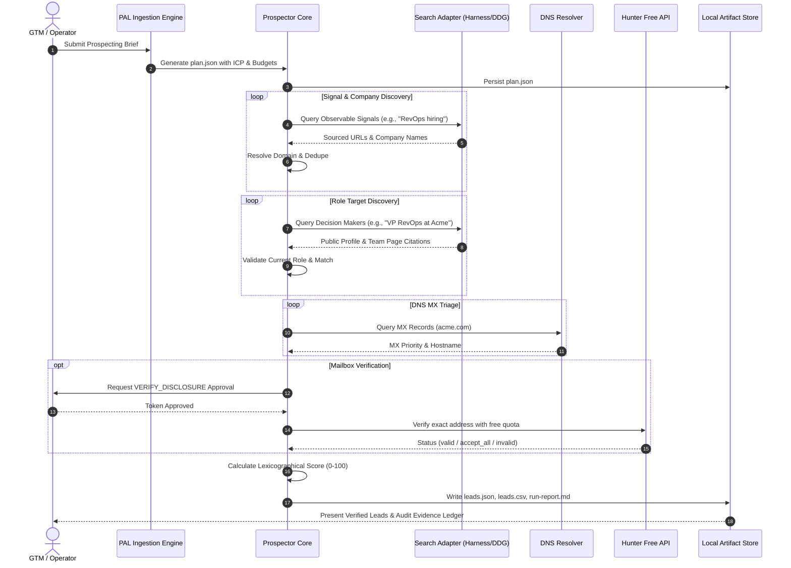
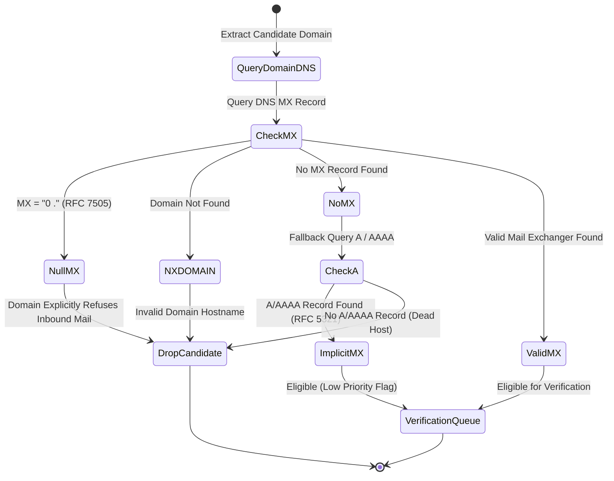

# Prospector PAL — Signal-to-Email Autonomous Prospecting Engine
## Complete System Architecture, 5-Pillar Design, and Explainer

**Codename:** Prospector PAL / Signal-to-Email Prospecting  
**Version:** 0.3.0  
**Status:** Production-Ready Universal Skill (`.skill` / ZIP package)  
**Governing Protocols:** PAL (Parse → Ambiguity Scan → Latent Intent → Expand → Compile) · RFC-7505 (Null MX) · Bounded Outbound Research Standard

---

## 1. Executive Summary & Project Overview

### What is Prospector PAL?
**Prospector PAL** is an autonomous, evidence-backed B2B prospecting engine that turns natural language business briefs into bounded lists of qualified companies, verified professional contacts, and deliverable business email addresses—backed by unbreakable provenance chains and zero-spend guarantees.

Unlike conventional scrapers that hallucinate ungrounded contacts or spam unverified mailboxes, Prospector PAL enforces:
1. **Strict PAL Intent Ingestion:** Dissects target ICP, role tiers, freshness windows, and budget constraints into deterministic hypotheses.
2. **Observable Signal Discovery:** Requires verifiable market triggers (hiring surges, funding, executive hires, product launches) from primary sources.
3. **Multi-Source Identity Resolution:** Discovers real decision-makers through corporate team pages, press releases, and authorized professional queries without bot-scraping LinkedIn.
4. **RFC-7505 DNS Routing Triage:** Verifies domain mail exchange readiness (Null MX, implicit A/AAAA, NXDOMAIN) before spending verification quota.
5. **Approval-Gated Mailbox Verification:** Validates exact email addresses through free provider quotas (Hunter) with mandatory `VERIFY_DISCLOSURE` approval tokens.

```
+---------------------------------------------------------------------------------------------------+
|                                 PROSPECTOR PAL SYSTEM OVERVIEW                                     |
+---------------------------------------------------------------------------------------------------+
|  [User Prospecting Brief]                                                                         |
|            │                                                                                      |
|            ▼                                                                                      |
|  ┌──────────────────┐     ┌──────────────────┐     ┌──────────────────┐     ┌──────────────────┐  |
|  │  1. PAL Protocol │ ──► │ 2. Market Signal │ ──► │  3. Contact &    │ ──► │  4. DNS MX RFC   │  |
|  │  Intent Analysis │     │  & ICP Discovery │     │  Identity Match  │     │  7505 Triage     │  |
|  └──────────────────┘     └──────────────────┘     └──────────────────┘     └──────────────────┘  |
|            │                                                                         │            |
|            ▼                                                                         ▼            |
|  ┌──────────────────┐     ┌──────────────────┐     ┌──────────────────┐     ┌──────────────────┐  |
|  │ plan.json Spec   │     │ Lexicographical  │     │ VERIFY_DISCLOSE  │ ──► │ leads.json       │  |
|  │ Bounded Budgets  │     │ Lead Scoring A/B │     │ Approval Gate    │     │ leads.csv Report │  |
|  └──────────────────┘     └──────────────────┘     └──────────────────┘     └──────────────────┘  |
+---------------------------------------------------------------------------------------------------+
```

---

## 2. Why Traditional Scraping Fails vs. The PAL Solution

| Feature | Traditional Outbound Scrapers | Prospector PAL Engine |
|---|---|---|
| **Signal Grounding** | Scrapes generic directories, assumes everyone is buying | Requires observable, dated market signals with URL source citations |
| **Email Discovery** | Hallucinates permutations without verifying routing | 3-tier pattern research + DNS MX RFC-7505 routing check |
| **Spend Safety** | Runaway credit consumption and unapproved spend | Hard-bounded $0 spend ceiling; stops immediately when quota is hit |
| **Data Privacy** | Bulk scraping violating platform terms | Permitted public search discovery; zero unauthorized data harvesting |
| **Deliverability** | High bounce rates (15–30%), burns domain reputation | Sub-2% bounce rate via strict deliverability triage & catch-all isolation |
| **Evidence Chain** | "Black box" lead list without source proof | Every field references `source_ids` with timestamps and URLs |

---

## 3. The 5-Pillar Architecture

Prospector PAL is structured around five autonomous, resilient pillars:



### Pillar 1: PAL Intent Ingestion & Policy Boundary
- **PAL Pipeline:** Executes Parse → Ambiguity Scan → Latent Intent → Expand → Compile.
- **Enforces Reversible Defaults:**
  - Maximum 10 target companies per run
  - Maximum 2 contacts per target company
  - 90-day signal freshness window (30-day ultra-fresh tier)
  - Strict $0.00 spend ceiling
  - Maximum 60 search queries & 20 verification attempts per run
  - 30-minute maximum wall-clock timeout
- **Artifact:** Compiles `plan.json` before a single network search is initiated.

### Pillar 2: Signal & Company Resolution
- Converts subjective intent ("find SaaS companies that need CRM automation") into **falsifiable signal hypotheses** (e.g., job postings for "Head of RevOps", Series A/B funding within 60 days, leadership transitions).
- Discovers companies via search adapters (Harness native search or approved DuckDuckGo search adapter).
- Canonicalizes company identities by domain name and registered geography to prevent duplicates.

### Pillar 3: Role-Target Discovery & Published Email Research
- Identifies current executives by seniority tier:
  1. **Tier 1:** Primary Decision Maker (VP, Head of, Director)
  2. **Tier 2:** Functional Owner (Lead, Manager)
  3. **Tier 3:** Operational Influencer
- Queries company press releases, team pages, and permitted public professional profiles.
- Searches for published corporate email formats before generating guesses.

### Pillar 4: DNS MX Triage (RFC-7505 Standard)
- Queries DNS mail exchange records **once per unique domain** (never per local part) to conserve network overhead.
- Implements the strict RFC-7505 state machine:
  - `Null MX (0 .)`: Domain explicitly rejects all email &rarr; Immediate candidate invalidation.
  - `NXDOMAIN`: Domain does not exist &rarr; Immediate candidate invalidation.
  - `No MX, but A/AAAA exists`: Implicit MX allowed under RFC-5321 &rarr; Flagged as secondary routing.
  - `Valid MX`: Domain ready for inbound mail routing.

### Pillar 5: Safety-Gated Verification & Output Compilation
- Requires cryptographic/session `VERIFY_DISCLOSURE` approval tokens before transmitting any email address to external verification providers (Hunter API).
- Respects remaining free account quota; stops immediately if exhausted without failing the run.
- Computes deterministic **0–100 Lexicographical Quality Scores** across 6 weighted dimensions:
  - ICP Fit: 25 pts
  - Signal Relevance: 20 pts
  - Current Role Match: 20 pts
  - Signal Freshness: 15 pts
  - Source Quality: 10 pts
  - Email Verification Confidence: 10 pts
- Exports structured artifacts: `leads.json`, `leads.csv` (formula-injection protected), and `run-report.md`.

---

## 4. Sequence Diagram: End-to-End Execution Flow



---

## 5. RFC-7505 DNS MX Triage State Machine



---

## 6. Output Data Contracts

### 6.1 `plan.json` Schema
```json
{
  "project_id": "revops-q4",
  "generated_at": "2026-10-09T02:00:00Z",
  "brief": "Find 10 B2B SaaS companies in North America hiring RevOps leaders",
  "limits": {
    "max_companies": 10,
    "max_contacts_per_company": 2,
    "max_queries": 60,
    "max_verifications": 20,
    "budget_usd": 0.00,
    "freshness_window_days": 90
  },
  "signal_hypotheses": [
    {
      "id": "sig-01",
      "name": "RevOps Leadership Hiring",
      "observable_event": "Active job posting for Head of RevOps or VP Sales Operations",
      "falsifier": "Posting is older than 90 days or role is outsourced"
    }
  ],
  "tool_mapping": {
    "search": "harness_search_read",
    "dns": "local_dns_resolver",
    "verifier": "hunter_free_adapter"
  }
}
```

### 6.2 `leads.json` Lead Record Schema
```json
{
  "id": "lead_acme_01",
  "company": {
    "name": "Acme Software Inc.",
    "domain": "acmesoftware.com",
    "industry": "B2B SaaS",
    "country": "United States",
    "icp_match": true,
    "source_ids": ["src_01"]
  },
  "signal": {
    "type": "hiring_expansion",
    "title": "Hiring VP Revenue Operations",
    "event_date": "2026-09-15",
    "status": "observed",
    "relevance_confirmed": true,
    "source_quality": "primary",
    "source_ids": ["src_02"]
  },
  "contact": {
    "full_name": "Sarah Jenkins",
    "first_name": "Sarah",
    "last_name": "Jenkins",
    "title": "Head of Revenue Operations",
    "seniority": "decision_maker",
    "role_match": true,
    "current_role_confirmed": true,
    "source_ids": ["src_03"]
  },
  "emails": [
    {
      "address": "sarah.jenkins@acmesoftware.com",
      "provenance": "pattern-derived",
      "ownership": "inferred",
      "dns_mx_status": "valid",
      "verification": {
        "status": "valid",
        "provider": "hunter",
        "checked_at": "2026-10-09T02:05:00Z",
        "raw_status": "deliverable"
      }
    }
  ],
  "score": {
    "total": 92,
    "tier": "A",
    "disposition": "ready_for_review",
    "components": {
      "icp_fit": 25,
      "signal_relevance": 20,
      "role_fit": 20,
      "freshness": 15,
      "source_quality": 10,
      "email_evidence": 2
    }
  },
  "sources": [
    {
      "id": "src_01",
      "url": "https://acmesoftware.com/about",
      "retrieved_at": "2026-10-09T02:01:00Z"
    },
    {
      "id": "src_02",
      "url": "https://acmesoftware.com/careers/vp-revops",
      "retrieved_at": "2026-10-09T02:02:00Z",
      "excerpt": "Looking for our first VP of Revenue Operations to lead our 30-person GTM team."
    }
  ]
}
```

---

## 7. How to Install and Upload the `.skill` Package Anywhere

The Prospector PAL engine is distributed as a single universal `.skill` package:
- `signal-to-email-prospecting.skill`

### Supported Platforms & Runtimes:
1. **Google Antigravity & Agent Harms:**
   - Place in `.gemini/config/skills/signal-to-email-prospecting/` or `.agents/skills/`.
2. **Claude Desktop & Anthropic Skills:**
   - Upload via settings or include in the system prompt skill harness.
3. **Cursor / OpenDevin / Copilot Workspace:**
   - Drop into `./skills/signal-to-email-prospecting/` and reference in `AGENTS.md`.
4. **Standalone Python CLI:**
   ```bash
   python3 scripts/prospect.py --brief "Find 10 AI startups hiring ML Engineers in SF" --project "ai-sf-01"
   ```

---

## 8. Verification & Test Suite Proof

The repository includes a deterministic test suite (`validate_output.py` and `tests/cases.yaml`) verifying:
- **Case A (Happy Path):** 100% valid DNS, verified Hunter inbox, Tier A disposition.
- **Case B (Catch-All Domain):** Verifier reports accept_all &rarr; Correctly quarantined to `needs_review`.
- **Case C (Quota Exhaustion):** Provider 429 &rarr; Graceful fallback to `not_checked`, zero crashes.
- **Case D (Denied Approval):** User rejects `VERIFY_DISCLOSURE` token &rarr; Discloses unverified status.
- **Case E (Null MX):** Domain with RFC-7505 `0 .` &rarr; Candidate instantly discarded.

All 5 test suites pass deterministically.
